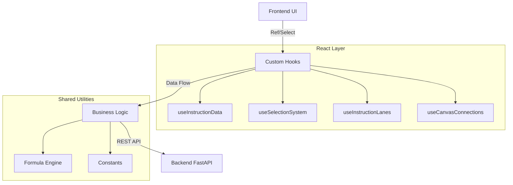

# YoRHa-HexFlow: Hex Instruction Orchestrator


**YoRHa-HexFlow** is a highly visual hexadecimal instruction orchestration tool designed to simplify complex low-level binary protocol design through a Block Flow approach. Its design is inspired by the UI style of *Nier: Automata*, emphasizing interaction fluidity and immersion.

<p align="center">
  
</p>

<p align="center">
  
</p>

## ✨ Key Features

### 1. Visual Orchestration
- **Drag & Drop Blocks**: Based on `@dnd-kit`, supporting infinite nested block dragging and sorting.
- **Dynamic Swimlanes**: Automatically generates hierarchical swimlane views based on data structure.
- **Smart Connections**: Automatically draws logical relationships between blocks (e.g., checksum references, length calculation references).

### 2. Powerful Logic Engine
- **Real-time Formula Calculation**: Supports dynamic formulas like `([FieldA] + 10) / 2`, with real-time preview of calculation results on the frontend.
- **Auto Counters & Time Accumulation**: Built-in intelligent blocks like `AUTO_COUNTER` and `TIME_ACCUMULATOR`.
- **Bitfield Editor**: The `BITFIELD` operator ships with a dedicated bit layout editor (`start_bit` / `bit_len` / `default_val`), persisted to the `bit_fields` table and packed by the encoder.
- **Multi-base Support**: Property panels support seamless switching between HEX/DEC/BIN input.

### 3. Export & Dispatch
- **Hex File Export**: `POST /export/hex` turns the assembled stream into a downloadable `.hex` file (Instruction Processing page).
- **Binary File Export**: `POST /export/binary` compiles the merged block forest server-side via the Orchestrator and returns a `.bin` file (Orchestration page).
- **Dispatch + Transport**: `POST /dispatch/` sends frames through the transport abstraction and keeps a bounded in-memory history (max 100) with three event kinds — raw / response / error. **The default mode is the in-process loopback channel (`/dispatch` contract unchanged); `POST /transport/config` switches to real TCP (stdlib socket) or serial (pyserial) transport, and `GET /transport/status` reports connection-state events.**

### 4. Data Hub (数据中心)
- **Environment Status Panel**: `GET /datahub/status` reports the DB path / size / mtime, row counts of all five tables, and the backend version.
- **Aggregate Export**: `GET /datahub/export/bundle` packages `instructions.json` (import-format symmetric with the Instruction page), `manifest.json`, and per-instruction skeleton frames (`frames/*.bin|.hex`, compiled by the Orchestrator) into one ZIP.
- **Backup & Restore**: `POST /datahub/backup` copies `yorha.db` into `backend/db/backups/` (gitignored); `POST /datahub/restore` takes an automatic `pre-restore-*` snapshot, releases the pool, clears WAL/SHM leftovers, and atomically replaces the file (filename traversal is rejected).

### 5. Engineering & Quality
- **SRP Architecture**: Strictly follows the Single Responsibility Principle, with logic hooked and components atomized.
- **Full-link Testing**: 
  - Integrated `Vitest` + `React Testing Library`.
  - 100% test coverage for core hooks.
  - Includes smoke tests to prevent crashes.

## 📌 Current Page Status

Page navigation labels, placeholder descriptions, and implementation status now use `frontend/src/config/pageStatus.json` as the single source of truth.

- See the current page matrix in [docs/PAGE_STATUS.md](./docs/PAGE_STATUS.md)
- `Protocol Definition`, `Instruction Management`, `Instruction Processing`, `Orchestration Binding`, and `Data Hub` are connected to the current SQLite / FastAPI main flow.
- `Communication Terminal` is still a placeholder page, and the documentation now reflects that explicitly.

---

## 🚀 Quick Start

### 1. Database Setup
The project now defaults to the repository-local SQLite database at `backend/db/yorha.db`. Tables, operator templates, and sample instructions are created automatically on first startup.

```bash
# No external database service required
```

### 2. One-Click Startup
On Windows, use the root script to boot both backend and frontend.

```bash
.\start-dev.ps1
```

The script will:
- install missing Python dependencies for the backend
- install missing Node dependencies for the frontend
- start the FastAPI backend on `http://127.0.0.1:8000`
- start the Vite frontend on `http://127.0.0.1:5173` when available, otherwise another free port

### 3. Manual Startup
If you want to run each side separately:

```bash
# Backend
python -m pip install -r backend/requirements.txt
python -m uvicorn backend.main:app --reload

# Frontend
cd frontend
npm install
npm run dev
```

### 4. Run Tests
Ensures the safety and stability of code modifications.

```bash
cd frontend
npm run test
```

---

## 🏗️ Architecture



For detailed technical specifications, please refer to: [SPECIFICATION.md](./SPECIFICATION.md)

---

## 📜 Directory Structure

```
/backend
    main.py              # FastAPI entry (lifespan: create_all + seeds)
    requirements.txt     # Python deps (includes pymysql, used only by debug_db.py)
    /routers             # HTTP routes (instruction, protocol, operator, compile, export, dispatch, datahub)
    /handlers            # Range logic (length, checksum)
    /core                # orchestrator.py (wired); processor.py / graph.py (legacy, unwired)
    /db                  # SQLAlchemy models + SQLite file backend/db/yorha.db (migrations/*.sql = non-authoritative)
                         # runtime backups land in /db/backups (gitignored)
    debug_db.py          # Standalone MySQL debug script (only pymysql consumer)

/frontend
    /src
        /components
            /ui         # Generic UI (NieRModal, NieRDatePicker)
            /editor     # Editor domain (Canvas, Block, BlockPropertiesPanel, ComponentPalette, ...)
            /InstructionForm  # Dynamic send form (InstructionRunner + extracted field tree/log)
        /hooks           # Business logic hooks (useInstructionData + instructionDataOptions contract, useInstructionForm, ...)
        /pages           # Page containers (Protocol, Instruction, InstructionProcessor, Orchestration, DataHub)
        /utils           # Pure utilities (InstructionEncoder.js = encoding core, formula.js, normalizeInstruction.js, blockMerge.js)
        /config          # pageStatus.json (page status SoT) + blockTypes.js / runnerRenderRules.js (testable render-rule configs)
        /api             # All HTTP calls, split by domain (client/protocols/instructions/export/dispatch/datahub + index)
        constants.js     # Global constants (OP_CODES, categories)
    /src/**/__tests__    # Vitest suites

/scripts
    generate-page-status.mjs  # Regenerates docs/PAGE_STATUS.md from pageStatus.json
    inspect_db.py             # SQLite debug script (path resolved relative to script)
```

> Unwired legacy code kept intentionally: `backend/core/processor.py`, `backend/core/graph.py`, `frontend/src/pages/Blueprint.jsx`. Do not delete; do not add new dependencies to them. See [PROJECT_HANDOVER.md](./PROJECT_HANDOVER.md) for the full file map.

## ⚠️ Development Guidelines
1. **Single Responsibility**: No single file should exceed 400 lines; complex logic must be extracted into Hooks.
2. **Test-Driven**: `npm run test` must be run after modifying core logic.
3. **DRY Principle**: Avoid Magic Strings; use `constants.js`.

---
*Glory to Mankind.*
