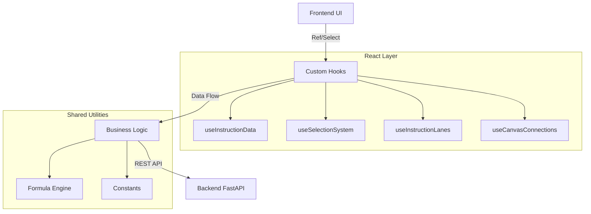

# YoRHa-HexFlow: Hex Instruction Orchestrator


**YoRHa-HexFlow** 是一个高度视觉化的 16 进制指令编制工具，旨在通过积木流 (Block Flow) 的方式简化复杂的底层二进制协议设计。其设计灵感来源于 *Nier: Automata* 的 UI 风格，强调交互的流畅性与沉浸感。

<p align="center">
  
</p>

<p align="center">
  
</p>

## ✨ 核心特性 (Key Features)

### 1. 可视化编排 (Visual Orchestration)
- **拖拽式积木 (Drag & Drop)**: 基于 `@dnd-kit`，支持无限层级嵌套的积木拖拽与排序。
- **动态泳道 (Swimlanes)**: 自动根据数据结构生成层级分明的泳道视图。
- **智能连线**: 自动绘制积木间的逻辑引用关系（如校验和引用、长度计算引用）。

### 2. 强大的逻辑引擎 (Logic Engine)
- **实时公式计算**: 支持 `([FieldA] + 10) / 2` 形式的动态公式，前端实时预览计算结果。
- **自动计数器 & 时间累计**: 内置 `AUTO_COUNTER` 和 `TIME_ACCUMULATOR` 等智能积木。
- **位域编辑器**: `BITFIELD` 算子配有专门的位布局编辑器（`start_bit` / `bit_len` / `default_val`），持久化到 `bit_fields` 表并由编码器按位打包。
- **多进制支持**: 属性面板支持 HEX/DEC/BIN 无缝切换输入。

### 3. 导出与下发 (Export & Dispatch)
- **Hex 文件导出**: `POST /export/hex` 将组装好的数据流导出为 `.hex` 文件（指令加工页）。
- **二进制文件导出**: `POST /export/binary` 由后端 Orchestrator 编译合并后的块结构并返回 `.bin` 文件（编排绑定页）。
- **环回下发**: `POST /dispatch/` 返回 ACK 并保留有界内存历史（最多 100 条）。**这是进程内环回通道——目前没有真实串口/TCP/WebSocket 传输。**

### 4. 工程化与质量 (Engineering)
- **SRP 架构**: 严格遵循单一职责原则，逻辑 Hook 化，组件原子化。
- **全链路测试**: 
  - 集成 `Vitest` + `React Testing Library`。
  - 核心 Hooks 测试覆盖率 100%。
  - 包含防崩溃的冒烟测试 (Smoke Tests)。

## 📌 当前页面实现状态

页面导航、占位说明和实现状态现在统一以 `frontend/src/config/pageStatus.json` 为单一来源。

- 当前页面状态总览请查看: [docs/PAGE_STATUS.md](./docs/PAGE_STATUS.md)
- 其中 `协议定义`、`指令管理`、`指令加工`、`编排绑定` 已接入当前 SQLite / FastAPI 主链路。
- `通讯调试` 与 `数据中心` 仍为占位页，文档与页面说明已按同一份状态清单对齐。

---

## 🚀 快速启动 (Quick Start)

### 1. 数据库初始化 (Database)
项目默认使用仓库内的 SQLite 数据库 `backend/db/yorha.db`，首次启动会自动建表并补充算子模板与示例指令数据。

```bash
# 无需额外数据库服务
# 首次启动后会自动生成/更新 backend/db/yorha.db
```

### 2. 一键启动 (Recommended)
Windows 下可直接使用根目录脚本同时拉起前后端。

```bash
# 双击 start-dev.bat
# 或在 PowerShell 中执行
.\start-dev.ps1
```

脚本会自动：
- 检查并安装后端 Python 依赖
- 检查并安装前端 Node 依赖
- 启动 FastAPI 后端 (`http://127.0.0.1:8000`)
- 启动 Vite 前端（优先 `http://127.0.0.1:5173`，被占用时自动换端口）

### 3. 手动启动 (Advanced)
如需分别启动，可按下面方式运行。

```bash
# Backend
python -m pip install -r backend/requirements.txt
python -m uvicorn backend.main:app --reload

# Frontend
cd frontend
npm install
npm run dev
```

### 4. 运行测试 (Run Tests) [NEW]
确保代码修改的安全性与稳定性。

```bash
cd frontend
npm run test
```

---

## 🏗️ 项目架构 (Architecture)



详细技术规格请参考: [SPECIFICATION.md](./SPECIFICATION.md)

---

## 📜 目录结构

```
/backend
    main.py              # FastAPI 入口（lifespan：建表 + 三个种子函数）
    requirements.txt     # Python 依赖（含 pymysql，仅 debug_db.py 使用）
    /routers             # HTTP 路由（instruction / protocol / operator / compile / export / dispatch）
    /handlers            # 区间逻辑（length、checksum）
    /core                # orchestrator.py（在用）；processor.py / graph.py（遗留，未接线）
    /db                  # SQLAlchemy 模型 + SQLite 文件 backend/db/yorha.db（migrations/*.sql 非权威）
    debug_db.py          # 独立 MySQL 调试脚本（唯一使用 pymysql 的地方）

/frontend
    /src
        /components
            /ui         # 通用 UI（NieRModal、NieRDatePicker、FeaturePlaceholder）
            /editor     # 编辑器域组件（Canvas、Block、BlockPropertiesPanel、ComponentPalette 等）
            /InstructionForm  # 动态发送表单（InstructionRunner + 拆出的字段树/日志）
        /hooks           # 业务逻辑 Hooks（useInstructionData、useInstructionForm 等）
        /pages           # 页面容器（Protocol、Instruction、InstructionProcessor、Orchestration）
        /utils           # 纯函数工具（InstructionEncoder.js = 编码核心、formula.js、normalizeInstruction.js）
        /config          # pageStatus.json（页面状态唯一数据源）
        /api             # 全部 HTTP 调用，按域拆分（client/protocols/instructions/export/dispatch + index）
        constants.js     # 全局常量（OP_CODES、分类）
    /src/**/__tests__    # Vitest 测试套件

/scripts
    generate-page-status.mjs  # 由 pageStatus.json 重新生成 docs/PAGE_STATUS.md
    inspect_db.py             # SQLite 调试脚本（路径相对脚本解析，任意 cwd 可跑）
```

> 有意保留的未接线遗留代码：`backend/core/processor.py`、`backend/core/graph.py`、`frontend/src/pages/Blueprint.jsx`。请勿删除，也不要向其中新增依赖。完整文件地图见 [PROJECT_HANDOVER.md](./PROJECT_HANDOVER.md)。

## ⚠️ 开发规范 (Guidelines)
1. **单一职责**: 单文件不超过 400 行，复杂逻辑必须提取 Hook。
2. **测试驱动**: 修改核心逻辑后必须运行 `npm run test`。
3. **DRY 原则**: 避免 Magic Strings，使用 `constants.js`。

---
*Glory to Mankind.*
